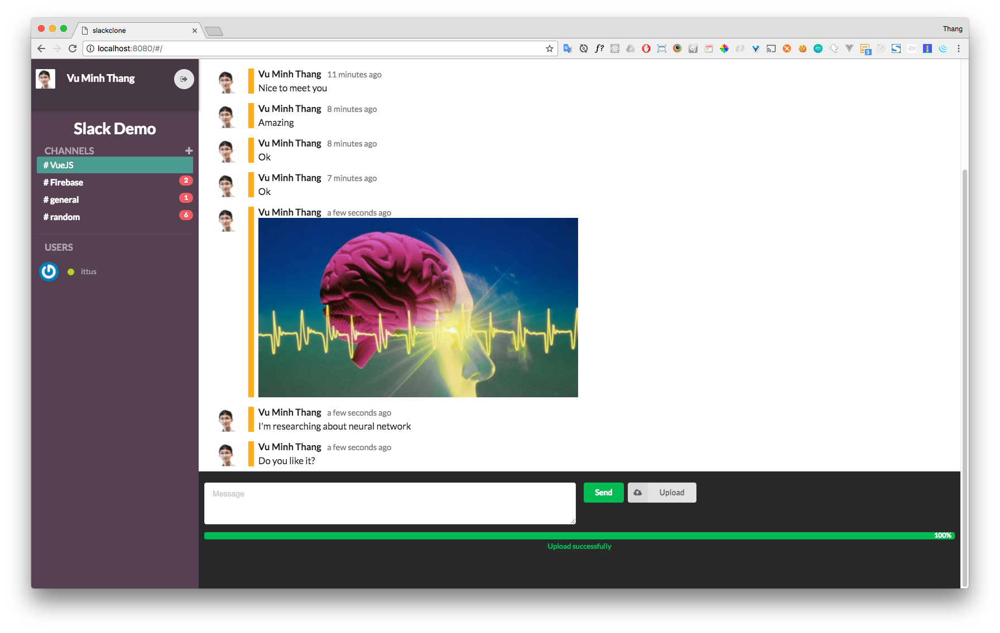

# Slack Clone real time VueJS

> Slack clone real time Using VueJS and Firebase
# Demo
https://slackclonevuejs.firebaseapp.com


# Technology
- VueJS
- Firebase
- SemanticUI
- Gravatar

## Build Setup

- Open `src/config/firebaseConfig.js` and change `const config` to your project's configuration

- Change Database rules in firebase to

```json
{
  "rules": {
    "channels": {
      ".read": "auth != null",
      "$channelId": {
        ".write": "auth != null",
        ".validate": "newData.hasChildren(['id', 'name'])",
        "name": {
          ".validate": "newData.val().length > 0"
        },
          "id": {
            ".validate": "newData.val() === $channelId"
          }
      }
    },
    "messages": {
      "$channelId": {
        ".read": "auth != null",
        ".validate": "root.child('channels/' + $channelId).exists()",
        "$messageId": {
          	".write": "auth != null",
            ".validate": "(newData.hasChildren(['content', 'user', 'timestamp']) && !newData.hasChildren(['image'])) || (newData.hasChildren(['image', 'user', 'timestamp']) && !newData.hasChildren(['content']))",
            "content": {
              ".validate": "newData.val().length > 0"
            },
             "image": {
               ".validate": "newData.val().length > 0"
             },
              "user": {
                ".validate": "newData.hasChildren(['name', 'avatar', 'id'])",
                  "id": {
                    ".validate": "newData.val() === auth.uid"
                  }
              }
        }
      }
    },
    "privateMessages": {
      "$uid1": {
        "$uid2": {
          ".read": "auth != null && ($uid1 === auth.uid || $uid2 === auth.uid)",
          "$messageId": {
            ".write": "auth != null && newData.child('user/id').val() === auth.uid",
            ".validate": "$uid1 < $uid2 && (newData.hasChildren(['content', 'user', 'timestamp']) && !newData.hasChildren(['image'])) || (newData.hasChildren(['image', 'user', 'timestamp']) && !newData.hasChildren(['content']))",
             "content": {
              ".validate": "newData.val().length > 0"
            },
            "image": {
               ".validate": "newData.val().length > 0"
             },
            "user": {
              ".validate": "newData.hasChildren(['name', 'avatar', 'id'])",
                "id": {
                  ".validate": "newData.val() === auth.uid"
                }
            }
          }
        }
      }
    },
    "presence": {
      ".read": "auth != null",
      ".write": "auth != null"
    },
    "users": {
      ".read": "auth != null",
      "$uid": {
        ".read": "auth != null",
        ".write": "auth != null && auth.uid === $uid",
        ".validate": "newData.hasChildren(['name', 'avatar'])",
          "name": {
            ".validate": "newData.val().length > 0"
          },
          "avatar": {
            ".validate": "newData.val().length > 0"
          }
      }
    }
  }
}
```

- Create folder `tchat` in firebase storage
Change storage rules in firebase to:
```
service firebase.storage {
  match /b/{bucket}/o {
    match /tchat {
    	match /public/{imagePath=**} {
      	allow read: if request.auth != null;
        allow write: if request.auth != null && request.resource.contentType.matches('image/.*') && request.resource.size < 1 * 1024 * 1024;
      }

      match /private/{user1}/{user2}/{imagePath=**} {
      	allow read: if request.auth != null && (request.auth.uid == $user1 || request.auth.uid == $user2);
        allow write: if request.auth != null && (request.auth.uid == $user1 || request.auth.uid == $user2) && request.resource.contentType.matches('image/.*') && request.resource.size < 1 * 1024 * 1024;
      }
    }
  }
}


```


``` bash
# install dependencies
npm install

# serve with hot reload at localhost:8080
npm run dev

# build for production with minification
npm run build

# build for production and view the bundle analyzer report
npm run build --report
```
